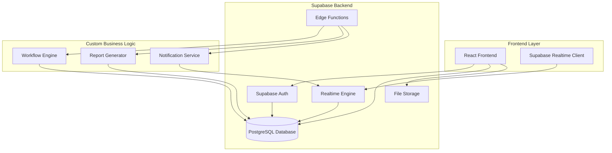

# Design Document

## Overview

The project management platform will be built as a modern web application with a microservices architecture to support scalability and maintainability. The system will provide a unified interface for multiple project management methodologies while maintaining flexibility for custom workflows.

### Key Design Principles
- **Methodology Agnostic**: Core entities and workflows that can adapt to different PM methodologies
- **Real-time Collaboration**: WebSocket-based updates for live collaboration
- **Extensible Architecture**: Plugin-based system for custom workflows and integrations
- **Performance Optimized**: Efficient data structures and caching for large-scale projects

## Architecture

### High-Level Architecture



### Technology Stack
- **Frontend**: React with TypeScript, Redux Toolkit for state management
- **UI Framework**: Material-UI or Ant Design or shadcn-ui for consistent components
- **Routing**: React Router for navigation
- **Database & Backend**: Supabase (PostgreSQL + Auth + Real-time + Storage)
- **Real-time**: Supabase Realtime for live updates
- **Charts**: Chart.js or D3.js for burndown charts and analytics
- **Drag & Drop**: React DnD for Kanban board interactions
- **Authentication**: Supabase Auth with social providers
- **File Storage**: Supabase Storage
- **Edge Functions**: Supabase Edge Functions for custom business logic

## Components and Interfaces

### Core Domain Models

#### Project Entity
```typescript
interface Project {
  id: string;
  name: string;
  description: string;
  methodology: 'scrum' | 'kanban' | 'waterfall' | 'custom';
  workflowId: string;
  ownerId: string;
  teamMembers: TeamMember[];
  settings: ProjectSettings;
  createdAt: Date;
  updatedAt: Date;
}

interface ProjectSettings {
  sprintDuration?: number; // days
  wipLimits?: Record<string, number>;
  workingDays: number[];
  timezone: string;
  estimationUnit: 'hours' | 'story_points' | 'days';
}
```

#### Task/Work Item Entity
```typescript
interface WorkItem {
  id: string;
  projectId: string;
  title: string;
  description: string;
  type: 'story' | 'task' | 'bug' | 'epic';
  status: string; // Dynamic based on workflow
  priority: 'low' | 'medium' | 'high' | 'critical';
  assigneeId?: string;
  reporterId: string;
  estimate?: number;
  actualTime?: number;
  sprintId?: string;
  parentId?: string; // For subtasks
  dependencies: string[];
  labels: string[];
  dueDate?: Date;
  createdAt: Date;
  updatedAt: Date;
}
```

#### Sprint Entity
```typescript
interface Sprint {
  id: string;
  projectId: string;
  name: string;
  goal: string;
  startDate: Date;
  endDate: Date;
  status: 'planning' | 'active' | 'completed';
  capacity: number;
  workItems: string[];
  retrospectiveNotes?: string;
  createdAt: Date;
}
```

#### Workflow Entity
```typescript
interface Workflow {
  id: string;
  name: string;
  isDefault: boolean;
  methodology: string;
  states: WorkflowState[];
  transitions: WorkflowTransition[];
}

interface WorkflowState {
  id: string;
  name: string;
  category: 'todo' | 'in_progress' | 'done';
  color: string;
  wipLimit?: number;
}

interface WorkflowTransition {
  from: string;
  to: string;
  conditions?: TransitionCondition[];
}
```

### Service Interfaces

#### Supabase Client Services
```typescript
// Direct database operations using Supabase client
interface ProjectService {
  createProject(data: CreateProjectRequest): Promise<Project>;
  getProject(id: string): Promise<Project>;
  updateProject(id: string, data: UpdateProjectRequest): Promise<Project>;
  deleteProject(id: string): Promise<void>;
  getProjectMembers(id: string): Promise<TeamMember[]>;
  addTeamMember(projectId: string, userId: string, role: string): Promise<void>;
}

interface TaskService {
  createWorkItem(data: CreateWorkItemRequest): Promise<WorkItem>;
  updateWorkItem(id: string, data: UpdateWorkItemRequest): Promise<WorkItem>;
  getWorkItem(id: string): Promise<WorkItem>;
  getProjectBacklog(projectId: string): Promise<WorkItem[]>;
  getSprintWorkItems(sprintId: string): Promise<WorkItem[]>;
  moveWorkItem(id: string, newStatus: string): Promise<WorkItem>;
  assignWorkItem(id: string, assigneeId: string): Promise<WorkItem>;
}
```

#### Edge Functions (Custom Business Logic)
```typescript
// Deployed as Supabase Edge Functions
interface WorkflowService {
  getWorkflow(id: string): Promise<Workflow>;
  createCustomWorkflow(data: CreateWorkflowRequest): Promise<Workflow>;
  validateTransition(workflowId: string, from: string, to: string): Promise<boolean>;
  getAvailableTransitions(workflowId: string, currentState: string): Promise<string[]>;
}

interface ReportService {
  generateBurndownChart(sprintId: string): Promise<ChartData>;
  calculateVelocity(projectId: string, sprintCount: number): Promise<VelocityData>;
  getProjectMetrics(projectId: string): Promise<ProjectMetrics>;
}
```

## Data Models

### Database Schema Design

#### Core Tables
- **projects**: Project metadata and settings
- **work_items**: Tasks, stories, bugs, epics
- **sprints**: Sprint information and planning
- **workflows**: Custom and default workflow definitions
- **workflow_states**: Individual states within workflows
- **workflow_transitions**: Valid state transitions
- **users**: User accounts and profiles
- **project_members**: Project team membership
- **comments**: Work item comments and discussions
- **attachments**: File attachments for work items

#### Relationships
- Projects have many WorkItems (1:N)
- Projects have many Sprints (1:N)
- Projects have one Workflow (N:1)
- WorkItems belong to one Sprint (N:1, optional)
- WorkItems can have many Dependencies (N:N)
- Users can be members of many Projects (N:N)

### Caching Strategy
- **Redis Cache**: Active project data, user sessions, real-time updates
- **Application Cache**: Workflow definitions, user permissions
- **CDN**: Static assets, generated reports

## Error Handling

### Error Categories
1. **Validation Errors**: Invalid input data, business rule violations
2. **Authorization Errors**: Insufficient permissions, expired tokens
3. **Resource Errors**: Not found, already exists, conflict states
4. **System Errors**: Database failures, external service unavailable

### Error Response Format
```typescript
interface ErrorResponse {
  error: {
    code: string;
    message: string;
    details?: Record<string, any>;
    timestamp: string;
    requestId: string;
  };
}
```

### Error Handling Strategy
- **Client-side**: User-friendly error messages, retry mechanisms
- **Server-side**: Structured logging, error aggregation, alerting
- **Database**: Transaction rollbacks, constraint violation handling
- **Real-time**: Connection recovery, message queuing for offline users

## Testing Strategy

### Unit Testing
- **Service Layer**: Business logic, data validation, workflow rules
- **Repository Layer**: Database operations, query optimization
- **Utility Functions**: Date calculations, estimation algorithms

### Integration Testing
- **API Endpoints**: Request/response validation, authentication flows
- **Database Integration**: Schema migrations, data consistency
- **External Services**: File upload, notification delivery

### End-to-End Testing
- **User Workflows**: Project creation, task management, sprint planning
- **Cross-browser**: UI compatibility, responsive design
- **Performance**: Load testing, concurrent user scenarios

### Testing Tools
- **Unit**: Jest, Mocha for JavaScript/TypeScript
- **Integration**: Supertest for API testing
- **E2E**: Cypress or Playwright for browser automation
- **Performance**: Artillery or k6 for load testing

## Frontend Design Architecture

### Component Structure
```
src/
├── components/           # Reusable UI components
│   ├── common/          # Generic components (Button, Modal, etc.)
│   ├── forms/           # Form components
│   └── charts/          # Chart components
├── pages/               # Page-level components
│   ├── Dashboard/       # Project dashboard
│   ├── Backlog/         # Product backlog management
│   ├── Board/           # Kanban/Scrum board
│   ├── Gantt/           # Gantt chart view
│   ├── Reports/         # Analytics and reporting
│   └── Settings/        # Project and user settings
├── hooks/               # Custom React hooks
├── services/            # API service layer
├── store/               # Redux store configuration
│   ├── slices/          # Redux Toolkit slices
│   └── middleware/      # Custom middleware
├── utils/               # Utility functions
└── types/               # TypeScript type definitions
```

### Key Frontend Features

#### Dashboard View
- Project overview with key metrics
- Recent activity feed
- Quick access to active sprints
- Team member status indicators

#### Board Views
- **Kanban Board**: Drag-and-drop task management with WIP limits
- **Scrum Board**: Sprint-focused task board with burndown integration
- **Custom Board**: Configurable columns based on workflow states

#### Gantt Chart View
- Interactive timeline with task dependencies
- Critical path highlighting
- Resource allocation visualization
- Milestone markers

#### Backlog Management
- Prioritized list with drag-and-drop reordering
- Story point estimation interface
- Bulk editing capabilities
- Sprint planning tools

#### Real-time Features
- Live cursor tracking for collaborative editing
- Instant task status updates
- Real-time notifications
- Collaborative commenting system

### State Management Strategy

#### Redux Store Structure
```typescript
interface RootState {
  auth: AuthState;
  projects: ProjectsState;
  workItems: WorkItemsState;
  sprints: SprintsState;
  ui: UIState;
  realtime: RealtimeState;
}
```

#### Key Redux Slices
- **authSlice**: User authentication and permissions
- **projectsSlice**: Project data and settings
- **workItemsSlice**: Tasks, stories, and backlog items
- **sprintsSlice**: Sprint management and planning
- **uiSlice**: UI state (modals, filters, view preferences)
- **realtimeSlice**: WebSocket connection and live updates

### Responsive Design
- Mobile-first approach with breakpoints for tablet and desktop
- Touch-friendly interactions for mobile devices
- Adaptive layouts for different screen sizes
- Progressive Web App (PWA) capabilities

### Performance Optimizations
- Code splitting by route and feature
- Lazy loading for heavy components (Gantt charts, reports)
- Virtual scrolling for large lists
- Memoization for expensive calculations
- Image optimization and lazy loading

## Security Considerations

### Authentication & Authorization
- JWT-based authentication with refresh tokens
- Role-based access control (RBAC)
- Project-level permissions (owner, admin, member, viewer)

### Data Protection
- Input validation and sanitization
- SQL injection prevention through parameterized queries
- XSS protection through content security policies
- Rate limiting for API endpoints

### Privacy & Compliance
- Data encryption at rest and in transit
- Audit logging for sensitive operations
- GDPR compliance for user data handling
- Secure file upload with virus scanning